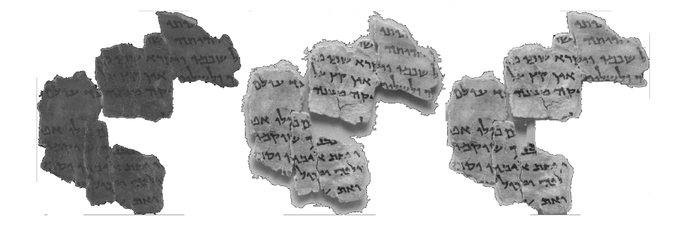
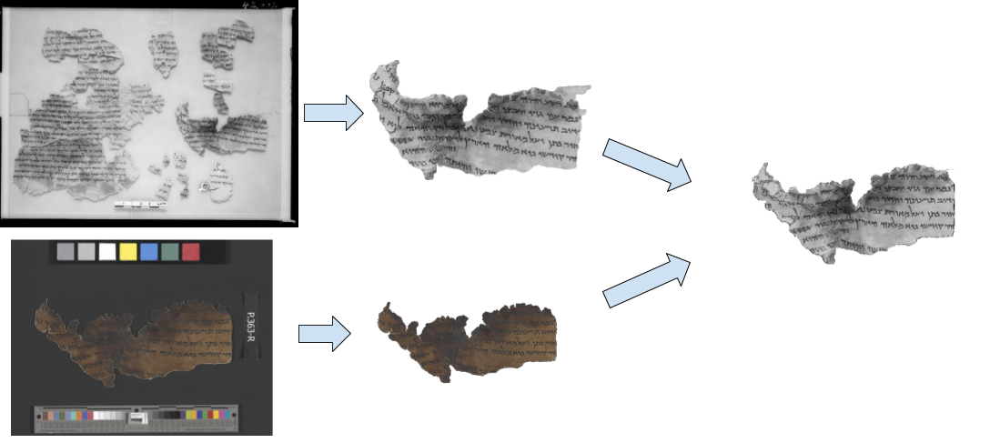

 <b>Alignment example</b>. Left: new high-quality fragment image; middle: cropped fragment from old grayscale image;  right: the fragment from the old image warped onto the recent image.

 <b>Method overview</b>.  Our system begins by segmenting the old plate (top left) and the new color image (bottom left). Segmentation results of the old plate and the new fragment are shown at the top middle and bottom middle, respectively. Finally, after a match is found, the system aligns the two fragments (seen on the right).

# Abstract 
The Dead Sea Scrolls are of great historical significance. Lamentably, in the decades since their discovery, many fragments have deteriorated. Fortunately, low-resolution grayscale infrared images of the Palestinian Archaeological Museum plates holding the scrolls in their discoveredstate are extant, along with recent high-quality multispectral images by the Israel Antiquities Authority. However, the necessary task of identifying each fragment in the new images on the old plates is tedious and time consuming to perform manually, and is often problematic when fragments have been moved from the original plate. We describe an automated system that segments the new and old images of fragments from the background on which they were imaged, finds their matches on the old plates and aligns and superimposes them. To this end, we developed a deep-learning based segmentation method and a cascade approach for template matching, based on scale, shape analysis and dense matching. We have tested the proposed method on five plates, comprising about 120 fragments. We present both quantitative and qualitative analyses of the results and perform an ablation study to evaluate the importance of each component of our system.

[Download paper here](../projects/dead_sea/dead_sea.pdf)

