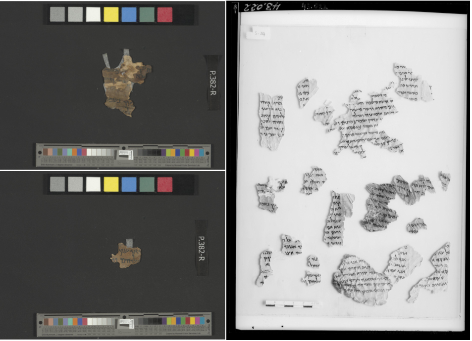

 <b>Illustration of the matching problem</b>. Left: two samples of recent color images  of fragments taken from plate 4Q57\_382. Right: an old infrared image of plate M43.022. Our system  successfully locates the two fragments on the left in the grayscale image of the whole plate. All images are provided courtesy of the Leon Levy Dead Sea Scrolls Digital Library, Israel Antiquities Authority; color photographer Shai Halevi, infrared by Najib Anton Albina

# Abstract 
The Dead Sea Scrolls are of great historical significance. Lamentably, in the decades since their discovery, many fragments have deteriorated. Fortunately, low-resolution grayscale infrared images of the Palestinian Archaeological Museum plates holding the scrolls in their discoveredstate are extant, along with recent high-quality multispectral images by the Israel Antiquities Authority. However, the necessary task of identifying each fragment in the new images on the old plates is tedious and time consuming to perform manually, and is often problematic when fragments have been moved from the original plate. We describe an automated system that segments the new and old images of fragments from the background on which they were imaged, finds their matches on the old plates and aligns and superimposes them. To this end, we developed a deep-learning based segmentation method and a cascade approach for template matching, based on scale, shape analysis and dense matching. We have tested the proposed method on five plates, comprising about 120 fragments. We present both quantitative and qualitative analyses of the results and perform an ablation study to evaluate the importance of each component of our system.

[Download paper here](../projects/dead_sea/dead_sea.pdf)
